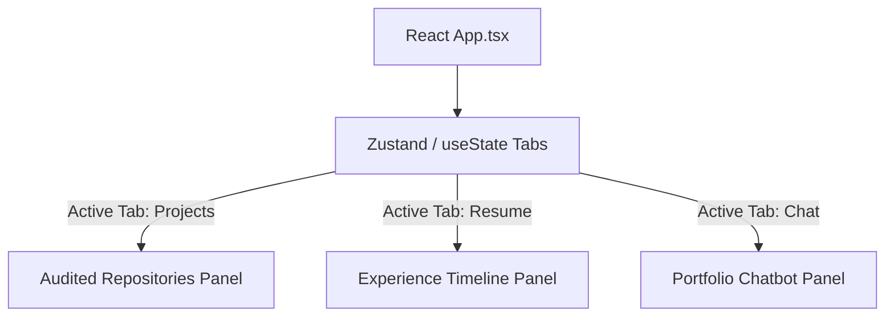

# System Architecture & Portfolio Layout

This document describes the architectural layout, styling guidelines, and QA chatbot of Aravind's developer portfolio.

## Frontend Layout

The portfolio site is a fully static client-side React 19 application designed to highlight technical and design proficiency:

### 1. Aesthetic Glassmorphism styling (`src/index.css`)
- Custom HSL parameters define color schemes.
- Ambient background radial gradients float in the background to add texture.
- Glassmorphic panels blur backdrop layers (`backdrop-filter: blur(24px)`) and use thin border borders (`border: 1px solid rgba(255,255,255,0.08)`) to maintain design depth.

### 2. Portfolio QA Chatbot (`src/App.tsx`)
Features a conversational UI helper:
- Intercepts user inputs and evaluates intent keywords.
- Maps inputs to structured responses regarding Aravind's stack, projects, and contact channels.
- Employs timed state delay updates (`setTimeout`) to simulate live conversation thinking times.
